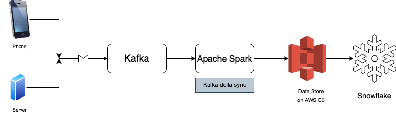
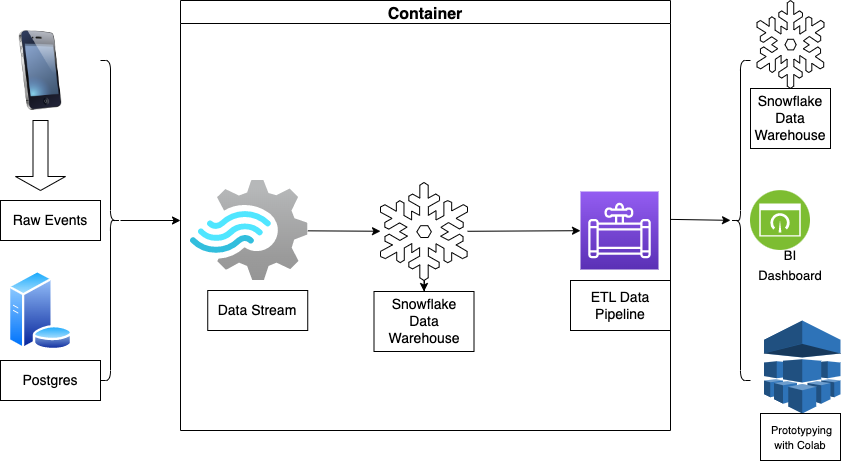

## IGA

IGA is a typescript iOS/Android app powered by Groq. It is designed with User experience best practices in mind and can serve as a starting template for developing a full-stack ai-agent application. A key feature of any delightful application is speed. This app uses Groq, a Language Processing Unit framework for ultra-fast inference on language models. 

We follow good data engineering principles when designing the pipelines that the agent relies on. For handling structured data, we use the Instructor [framework](https://github.com/jxnl/instructor).
### Features

* **UX-Design** - IGA uses UX design best practices, ensuring a seamless and intuitive user experience.

* **Full-Stack** - The template comes with a full-stack implementation, including a robust backend and a responsive frontend. 

* **Reusable Template** - IGA can be easily tailored to fit the needs of different applications, making it a highly reusable template.

### App requirements
* Localisation
* Playing audio and video
* Access to user's contacts
* Track the movement of the user's finger on screen
* Track orientation and motion
  

#### Backend Architecture

#### ETL Pipeline

#### Front-End
**Vercel**

### Contributing

1. Fork the Project
2. Create your Feature Branch (`git checkout -b feature/AmazingFeature`)
3. Commit your Changes (`git commit -m 'Add some AmazingFeature'`)
4. Push to the Branch (`git push origin feature/AmazingFeature`)
5. Open a Pull Request

## References

1. Devlina Das. How Instacart Ads Modularized data pipelines with lakehouse architecture and spark. https://tech.instacart.com/how-instacart-ads-modularized-data-pipelines-with-lakehouse-architecture-and-spark-e9863e28488d
2. iPhone Application Development for Dummies. Neal Goldstein.
3. Shane Hender. Moving from DynamoDB to tiered storage with MySQL+S3
]
